# STAT5243-Project-1
This is repository for Columbia University STAT GR2543 Project 1
# Project 1 Report — IBM Job Postings Data Pipeline 

**Course:** STAT5243 — Project 1
**Dataset:** IBM job postings (web-scraped)
**Team Members:** Kevin Ma, Shuzhi Yang, Baixuan Chen, Carrie Yan Yin Feng
**Date:** Feb 2026
**GitHub Link:** [STAT5243-Project-1](https://github.com/00Kisumi00/STAT5243-Project-1/tree/main)

---

## Repository structure (what each file does)

ibm_scraping.ipynb: Web scraping notebook used to collect IBM job postings and export the raw CSV.

ibm_jobs.csv: Scraping output (raw dataset) used as the starting point for cleaning and analysis.

Project_1(EDA added).ipynb: Full analysis pipeline notebook (cleaning → preprocessing → EDA → feature engineering) and figure generation.

README.md: Written report summarizing methodology, results, and takeaways; includes figures exported from the notebook.

--- 

## 1. Introduction and Dataset Description

In the rapidly evolving 2026 tech landscape, job postings are more than just advertisements, they are a data-rich reflection of a company's strategic priorities. Job postings are semi-structured: some fields (salary bands, dates) look numeric but arrive as messy strings, and other fields (technical experience) are free text. In this project, we scraped 478 IBM job postings and built a reproducible pipeline to convert raw postings into an analysis-ready dataset. Our analysis focuses on how compensation varies by posting type (professional, entry level, internship), job family, and skill requirements, and we use feature engineering to turn multi-location fields and unstructured text into measurable signals.

### 1.1 Dataset Overview

A major data issue was that many postings listed multiple states in one row (e.g., “Texas, Massachusetts, California”). Treating each full string as a category would create sparse, hard-to-interpret location groups, so we engineered features that capture (1) how many states were listed and (2) a coarse region for comparison.

**Shape:** 478 rows × 11 columns

### 1.2 Data Dictionary (Columns)

| Column                           | Type (raw)       | Meaning                                                        |
| -------------------------------- | ---------------- | -------------------------------------------------------------- |
| `job_title`                      | text             | Job title string shown in the posting                          |
| `job_id`                         | text/id          | Unique identifier for the posting                              |
| `date_posted`                    | text             | Posting date (e.g., `30-Jan-2026`)                             |
| `state_province`                 | text             | Location field (often one or multiple states)                  |
| `area_of_work`                   | text             | Job function category (e.g., Consulting, Software Engineering) |
| `min_salary`                     | text/number-like | Minimum annual salary (string formatted)                       |
| `max_salary`                     | text/number-like | Maximum annual salary (string formatted)                       |
| `position_type`                  | text             | Professional / Internship / Entry Level / etc.                 |
| `required_education`             | text             | Required education level                                       |
| `preferred_education`            | text             | Preferred education level (often missing)                      |
| `preferred_technical_experience` | text             | Unstructured text describing desired experience/skills         |

### 1.3 Why This Dataset?

Job postings are a strong real-world example of semi-structured data: salary fields are formatted inconsistently, location fields may contain multiple values, and the “preferred technical experience” field is unstructured text. This creates meaningful opportunities for advanced cleaning and feature engineering, aligning with the project’s emphasis on real-world data challenges. 

---

## 2. Data Acquisition Methodology

### 2.1 Source and Collection Strategy

**Kevin Ma** acquired the dataset through **web scraping** IBM’s public job listings. The scraping workflow followed a structured approach:

1. Identify relevant IBM job listing pages (search results + individual job pages).
2. Iterate through listings (pagination / repeated page loads).
3. Extract structured fields for each posting (title, job id, date, location, salary range, area of work, education, and technical experience).
4. Store results in a CSV file (`ibm_jobs.csv`) for downstream processing.

This acquisition approach satisfies the project requirement to obtain data from sources such as web scraping. 

**Scraping Output Snapshot**
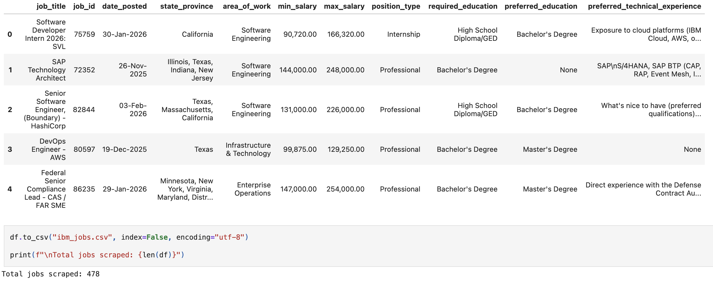
This snapshot demonstrates why web scraping was necessary: key variables (salary ranges, education, and technical experience) are not provided as a clean dataset and must be collected from individual job pages. The result is realistic “messy data”: inconsistent formatting, missing optional fields, and multi-value location strings that require cleaning and feature engineering downstream. 

### 2.2 Acquisition Challenges (and how we handled them)

* **Pagination / repeated listings:** Web job portals often show repeating listings across pages. We relied on `job_id` as a stable key for deduplication downstream.
* **Inconsistent formatting:** Salary appeared as formatted text (commas/decimals), and locations sometimes contained multiple states. These were handled during cleaning and feature engineering.
* **Missing fields:** Not all postings include preferred education or technical experience. Missingness was tracked and handled in later steps.

---

## 3. Cleaning and Preprocessing Steps

The scraped dataset required substantial cleaning before analysis. Salary fields were stored as formatted strings (commas and symbols), locations often listed multiple states in a single cell, and several “preferred” fields were missing. We treated these as real data-quality issues rather than simply dropping rows: we standardized types, validated salary consistency, tracked missingness explicitly, and engineered location structure (e.g., number of states listed) so that the complexity of the raw data was preserved in a usable form. 

### 3.1 Cleaning (Kevin Ma)

**Key cleaning actions:**

* **Deduplication:** Removed duplicate job postings using `job_id` as a unique key (**7 duplicated `job_id`s** observed in the raw file).

**Duplicates Removed**

Deduplicating by job_id prevents repeated postings from inflating counts in EDA (e.g., role frequency, location frequency). This matters because later comparisons (salary by role type, skill flags) assume each row is a unique job posting, not a repeated listing.

* **Uniform formatting:** Trimmed whitespace in string fields to avoid category fragmentation (e.g., `"Texas"` vs `" Texas"`).
* **Type correction:** Converted salary fields stored as strings into numeric values; parsed `date_posted` into a datetime.
* **Missing value handling (baseline):**

  * Preserved missingness in optional fields so later preprocessing and modeling can treat “missing” meaningfully rather than overwriting it prematurely.

**Salary fields cleaned**
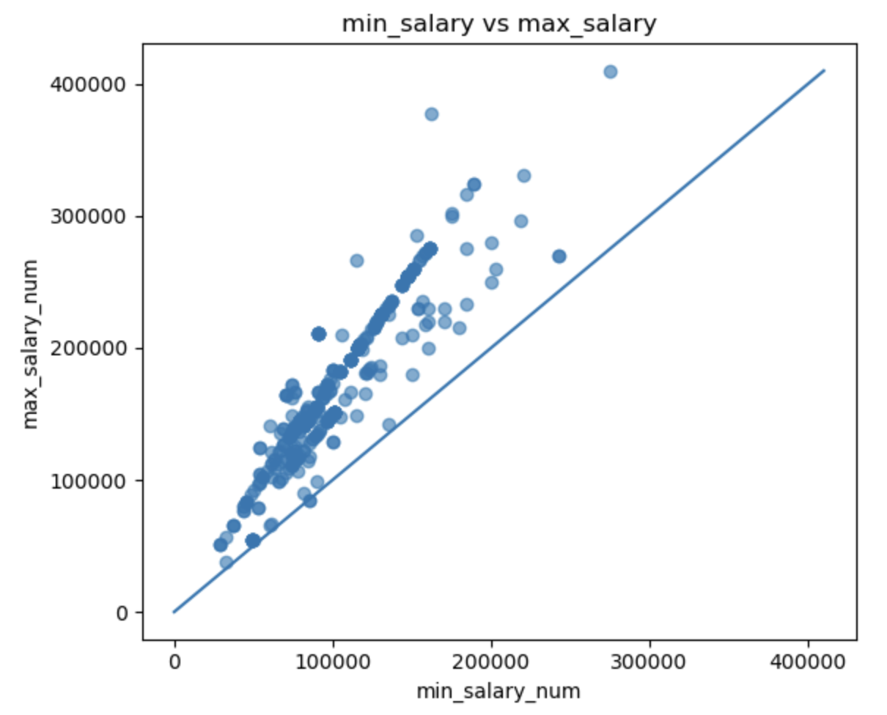

Cleaning salary strings into numeric fields is the foundation for all later analysis. After cleaning, we verified basic consistency (e.g., max_salary is not less than min_salary), which increases confidence that downstream features like mid_salary and salary_range reflect real compensation bands rather than parsing errors.

### 3.2 Preprocessing (Baixuan Chen)

Preprocessing focuses on preparing features for analysis/modeling (without necessarily creating new meaning). Consistent with the project requirements, preprocessing includes steps such as normalization/standardization and encoding categorical variables. 

**Preprocessing approach:**

* **Missing values**

  * For structured categorical fields (e.g., education), missing values were assigned a consistent placeholder category (e.g., `"Unknown"`), so they remain usable in grouped analysis.
  * For unstructured text (technical experience), missing values were converted to empty strings to avoid errors in text-based processing.
* **Numeric conversions**

  * Salary strings were cleaned (removing commas and symbols) and converted to numeric.
* **Encoding strategy (model-ready)**

  * Categorical columns are suitable for one-hot encoding when modeling.
  * Numeric columns are suitable for scaling if used in regression models.

### 3.3 Missingness Summary (Raw Dataset)

To document data quality issues clearly, we measured missingness rates:

* `preferred_education`: ~25.7% missing
* `preferred_technical_experience`: ~19.2% missing
* `required_education`: ~2.5% missing
* `area_of_work`: ~1.0% missing

This confirms the dataset contains meaningful real-world incompleteness—especially in “preferred” fields that companies often omit.

**Data Overview**
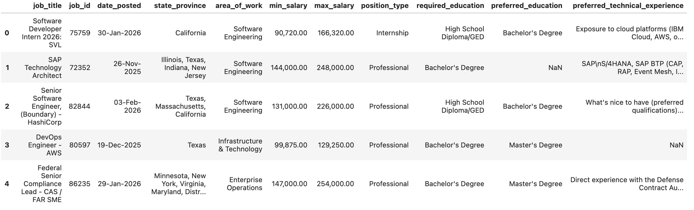
This missingness is not random “noise” — it reflects how companies selectively disclose preferences. Because of that, we preserved missingness intentionally (instead of dropping rows), and later engineered indicators such as has_preferred_edu_specified and safe text handling (empty strings) so models and group comparisons can treat “missing” as meaningful.

### 3.4 Key challenges and how we handled them

- **Challenge 1: Salary fields were not numeric (parsing risk).**  
  **What we saw:** `min_salary` and `max_salary` arrived as formatted strings, so analysis could silently treat them as text or mis-parse commas.  
  **What we did:** cleaned them into numeric columns and validated consistency by checking `max_salary ≥ min_salary` (see the min-vs-max plot).  
  **Why it matters:** all salary-based insights (midpoints, ranges, group comparisons) depend on this step.

- **Challenge 2: Location was not single-valued (multi-state postings).**  
  **What we saw:** many postings listed multiple states in one row.  
  **What we did:** engineered `n_states_listed`, `is_multi_state_posting`, `primary_state`, and `primary_region`.  
  **Why it matters:** it preserves real flexibility without exploding the number of categories.

- **Challenge 3: “Preferred” fields had systematic missingness.**  
  **What we saw:** preferred education/experience fields were often missing, likely reflecting employer disclosure choices.  
  **What we did:** avoided dropping rows; used consistent placeholders and missingness-aware features (e.g., `has_preferred_edu_specified`).  
  **Why it matters:** keeps the dataset representative and avoids bias toward “more detailed” postings.

- **Challenge 4: High-cardinality categories.**  
  **What we saw:** fields like `state_province` and `job_title` can create too many unique levels.  
  **What we did:** rare-category pooling + engineered abstractions (region, seniority flags, skill indicators).  
  **Why it matters:** improves interpretability and makes future modeling more stable.

---

## 4. Exploratory Data Analysis (EDA)

**Shuzhi Yang** performed the EDA to understand the distribution of job types, salary ranges, and relationships between role characteristics and compensation. The EDA aligns with project expectations: summary statistics, distribution plots, relationship exploration, and initial interpretations. 

### 4.1 Salary Distribution Overview

After converting salaries to numeric:

* **Median midpoint salary (`mid_salary`)**: **$134,000**
* **Mean midpoint salary**: **~$141,138**
* **Minimum midpoint salary**: **$35,500**
* **Maximum midpoint salary**: **$342,500**

Salary ranges were often wide:

* **Median salary range (`max - min`)**: **$69,900**
* **Max salary range**: **$216,000**
* Some postings had a **0 range** (min = max), suggesting a fixed-band listing.

Interpretation: compensation is right-skewed and varies strongly by role class and seniority.

**Mid-salary Distribution Histogram**
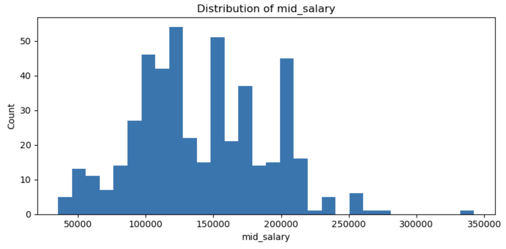

**Mid-salary Distribution Boxplot**
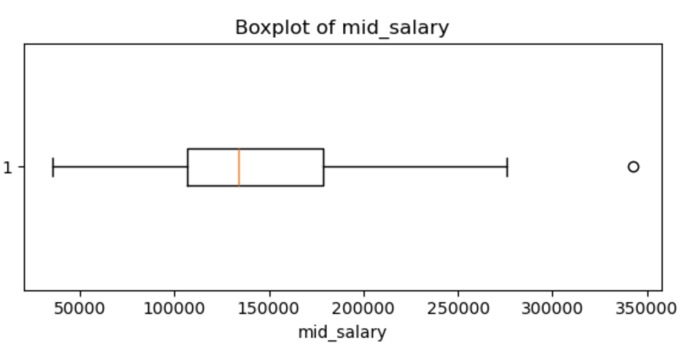

Takeaway: salary is strongly right-skewed (a small number of high-pay roles stretch the distribution), which is why we later engineered log_mid_salary for more stable comparisons across job groups. 

### 4.2 Job Type Composition

Posting counts by `position_type`:

* **Professional:** 273
* **Internship:** 103
* **Entry Level:** 92
* **Administration & Technician:** 10

Interpretation: IBM postings in this scrape are dominated by professional roles, but internships and entry-level roles are also well represented, which creates a broad salary spread.

**Job Type Categories**
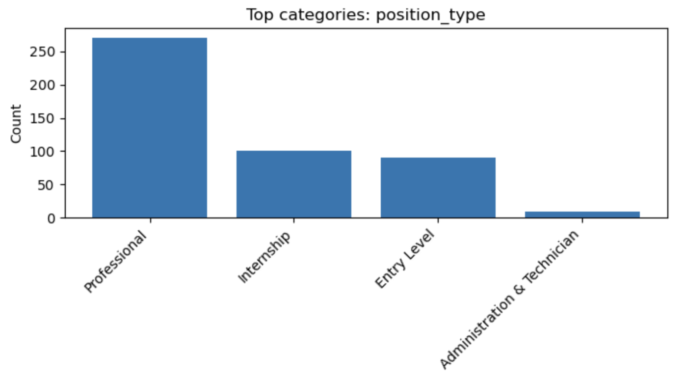

### 4.3 Salary by Position Type

Median midpoint salary by type:

* **Professional:** **$174,000**
* **Entry Level:** **$113,500**
* **Internship:** **$103,650**
* **Administration & Technician:** **$56,000**

Interpretation: compensation differences across posting type are large and consistent with expected labor market structure.

**Mid-salary By Position**
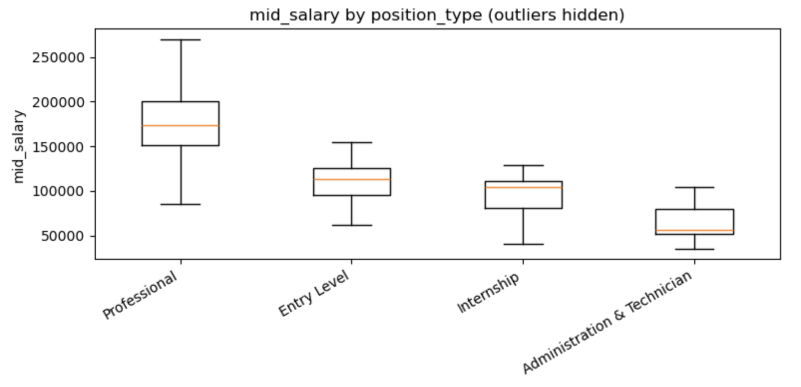

The median midpoint gap between Professional (~$174k) and Internship (~$104k) postings is large enough that “level/seniority” is likely a primary driver of pay differences. This motivated our title-based seniority features to capture level signal even when position_type is broad. 

### 4.4 Area of Work Insights

Most common `area_of_work` categories included Consulting, Software Engineering, and Infrastructure & Technology. Salary medians varied substantially across these categories, suggesting job function is an important explanatory variable.

**Area of Work Insights**
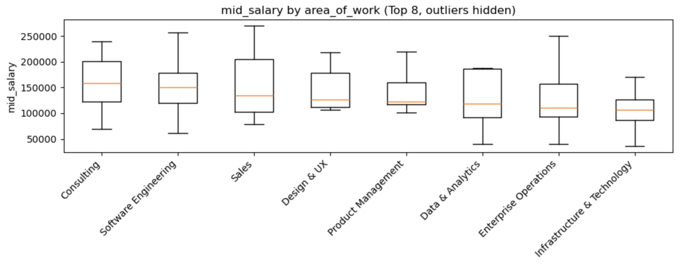

### 4.5 Location Field Complexity

The `state_province` column often included **multiple states** in one row (e.g., “Texas, Massachusetts, California”), which indicates flexible or multi-location postings. This motivated our later feature engineering on location structure.

Since many postings include multiple states, a single “state” category can’t represent location well. This led us to engineer features capturing multi-state flexibility and coarse regions instead of treating location as a single label.

**Location Field**
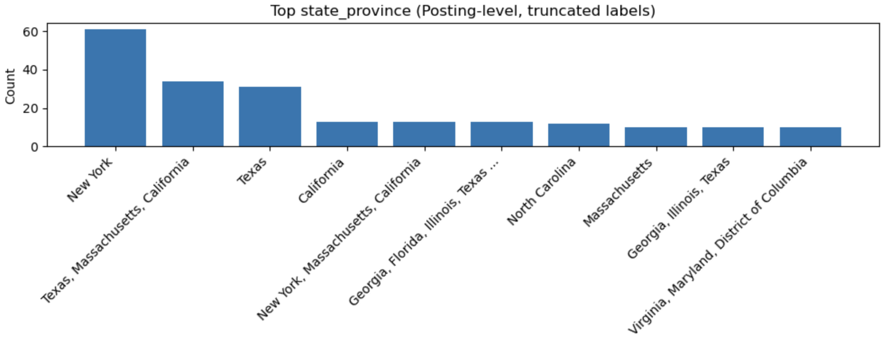

The location field isn’t a simple “state” variable; many postings list multiple states in one row, which can represent geographic flexibility (hybrid/remote) rather than ambiguity. Treating it as one category would hide that structure, so we engineered n_states_listed and is_multi_state_posting as a measurable flexibility signal.

Across EDA, three patterns guided our next steps. First, compensation is right-skewed, so we emphasized medians and later used a log transform for modeling stability. Second, salary differs substantially across position types and job functions, indicating that role level and job family are major correlates of pay. Third, several high-signal fields are not cleanly structured (multi-state locations and free-text technical experience). These observations motivated our feature engineering strategy: create salary-band features, quantify location flexibility, convert education into ordinal levels, extract seniority from titles, and transform experience text into skill indicators.
---

## 5. Feature Engineering Process and Justification (Carrie Feng)

We realized that a 'Bachelor’s Degree' means something very different if it is 'Required' versus 'Preferred.' We created the 'Education Gap' feature to quantify the aspirational level of a role. Furthermore, we moved beyond the job title by using regex pattern matching to engineer binary 'is_senior' and 'is_manager' flags. Feature engineering focused on turning semi-structured fields into interpretable predictors. We quantified differences between required vs preferred education (education gap), extracted seniority indicators from job titles, and converted technical experience text into skill and experience features that can be compared across postings.

### 5.1 Salary Structure Features (Turning “range” into signal)

**Problem:** Raw `min_salary` and `max_salary` are informative, but they do not explicitly represent compensation structure.

**Engineered features:**

* `mid_salary` = (min + max) / 2
* `salary_range` = max − min
* `salary_range_pct` = (max − min) / mid_salary
* `min_to_max_ratio` = min / max
* `log_mid_salary` = log(mid_salary)

**Log_mid_salary**
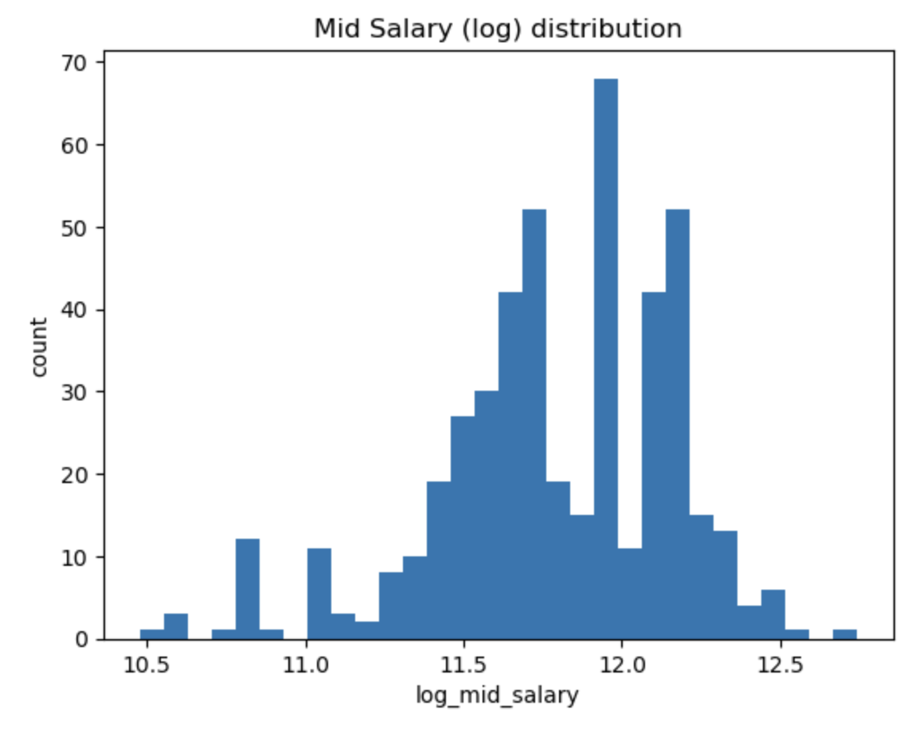
The log transform reduces the long right tail in salary and makes patterns across groups (position type, job family, skills) easier to compare.

**Why this helps:**
Range width can proxy how flexible the role level is, and log transforms reduce skew and improve robustness for future modeling.

### 5.2 Time-Derived Features (Recency + seasonality)

**Problem:** `date_posted` is text; time patterns are not directly usable.

**Engineered features:**

* `days_since_posted` (relative to the latest posting in the dataset)
* `posted_month`, `posted_day_of_week`, `posted_is_weekend`

**Why this helps:**
Hiring cycles and urgency may influence salary bands and role availability over time.

### 5.3 Location Structure Features (Multi-state postings + region)

Multi-state is the norm: ~62.3% of postings list more than one state; the median posting lists 3 states; one posting listed 49 states (effectively nationwide).

Flexibility relates to pay (within Professional roles): Professional postings that are multi-state have a higher median midpoint salary (~$178.5k) than single-state professional postings (~$165.3k).

**Problem:** `state_province` sometimes contains multiple states, which can’t be modeled as a single clean category.

**Engineered features:**

* `states_list` (parsed list)
* `n_states_listed`
* `is_multi_state_posting`
* `primary_state` (first listed state)
* `primary_region` (coarse mapping: Northeast/Midwest/South/West)

**Why this helps:**
Multi-state postings likely reflect geographic flexibility (e.g., hybrid/remote or multiple offices). Capturing this with `n_states_listed` and `is_multi_state_posting` preserves meaningful variation without creating thousands of sparse location categories. Mapping a primary region further reduces noise while keeping geographic structure for comparison.

### 5.4 Education as Ordinal Signal (and “education gap”)

**Problem:** Education is not merely categorical; it has a natural order, and preferred vs required difference is meaningful.

**Engineered features:**

* `required_edu_level`, `preferred_edu_level` (ordinal mapping)
* `edu_gap_preferred_minus_required`
* `has_preferred_edu_specified`

**Why this helps:**
More selective roles may correlate with higher compensation and different job families.

### 5.5 Job Title Parsing (Seniority + role family extraction)

**Problem:** Job title includes strong but hidden salary signals (e.g., Senior, Lead, Manager).

**Engineered features (binary flags):**

* Seniority: `is_intern`, `is_entry`, `is_senior`, `is_lead`, `is_manager`, `is_architect`
* Role family: `role_engineering`, `role_data`, `role_security`, `role_product`, etc.

**Why this helps:**
These features are interpretable, strong predictors of pay, and reduce the need for manual labeling.

**Seniority**
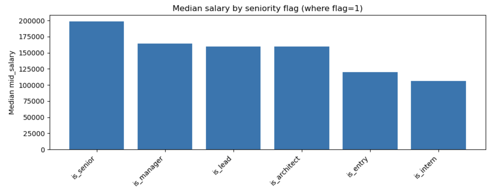

The engineered seniority flags behave as expected: postings labeled “senior/lead/manager” show higher median salaries than entry/intern indicators, validating that title parsing captures real compensation structure.

### 5.6 Skills + Experience from Text (Advanced unstructured feature extraction)

**Problem:** `preferred_technical_experience` is unstructured text.

**Engineered features:**

* Experience years parsed from text: `exp_years_min`, `exp_years_max`, `exp_years_any`
* Skill flags (examples): `skill_python`, `skill_sql`, `skill_aws`, `skill_azure`, `skill_kubernetes`, etc.
* `n_skills_mentioned` = total count of detected skill keywords

**Why this helps:**
In exploratory comparisons, higher-pay professional postings more frequently mentioned cloud and ML keywords (e.g., AWS/Azure/ML) than lower-pay postings, suggesting that text-derived skill features capture useful signal — though causal claims would require a predictive model and validation.

**Number of Skills**
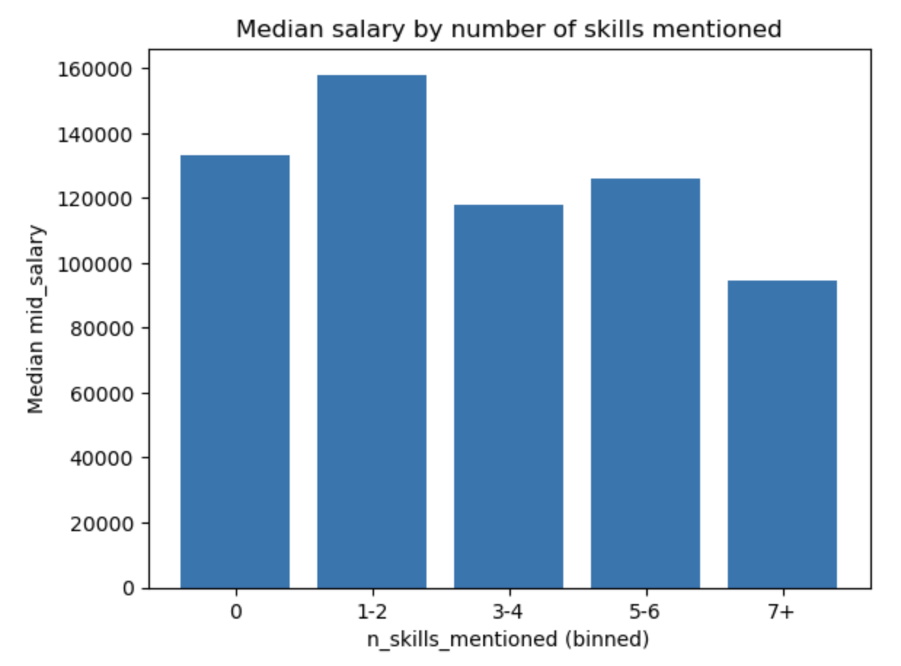

Skill density shows a positive relationship with salary, supporting the idea that converting unstructured requirements text into skill indicators captures job complexity.

### 5.7 Validation of engineered features

- **Salary transformation:** `log_mid_salary` reduces the long right tail so comparisons are less dominated by extreme values.
- **Title seniority flags:** median salaries increase in the expected direction for `senior/lead/manager` flags vs `entry/intern`.
- **Multi-location flexibility:** multi-state postings are common, and treating flexibility as a feature preserves signal without exploding categories.

### 5.8 What feature engineering revealed (insights from engineered features) (new section; paste this)

Feature engineering did more than create “extra columns”—it made hidden structure measurable:

Seniority signals are strongly tied to salary.
After extracting seniority markers from job titles (e.g., senior/lead/manager/director), we observed that postings flagged as higher-seniority consistently had higher median salaries than entry/intern-flagged postings. This validates title parsing as a high-signal feature and supports the idea that “level” drives compensation differences beyond broad position_type.

Skill density in technical experience text tracks compensation.
Converting free-text experience descriptions into skill flags (Python/SQL/cloud/ML) and a total skill count (n_skills_mentioned) revealed a clear pattern: postings mentioning more distinct technical requirements tend to have higher median salaries. This suggests job complexity/specialization is reflected in the language of requirements.

Location flexibility is common and should be treated as a feature, not noise.
Many postings listed multiple states, which likely represents flexible placement rather than ambiguity. Our is_multi_state_posting and n_states_listed features preserve this structure and provide a more meaningful way to compare postings than treating each multi-state string as its own category.

Education “gap” captures selectiveness.
Mapping education to an ordinal scale and computing the difference between preferred vs required education created a compact indicator of selectiveness. Postings that specify stronger preferred education often align with higher compensation bands, especially within professional roles (exploratory observation).
---

## 6. Summary of Key Findings

1. **Salary levels differ strongly by posting type.** Professional roles have much higher median pay than internships/entry level (professional median midpoint ~$174k vs internships ~$104k).
2. **Salary ranges are wide and meaningful.** Many postings include broad compensation bands; range-based features capture this structure directly.
3. **Job title seniority correlates with pay.** Titles containing “Senior” tend to have higher median midpoint salary than entry/intern indicators, supporting the value of title-parsed features.
4. **Location is complex, not single-valued.** Many postings list multiple states, so “multi-location flexibility” is a real structural feature, not noise.
5. **Preferred fields are frequently missing.** Preferred education and technical experience are often omitted, so missingness handling and missing-indicator logic are important for reliability.
6.  Right-skew explains why medians matter. The mean midpoint salary is pulled upward by a smaller number of very high-pay roles, so we used medians for group comparisons and engineered log_mid_salary for stability.
7. Level signal exists beyond position_type. Even within broad categories, title-based seniority markers separate salary bands, which supports the value of parsing job titles into structured features.
8. Unstructured text contains measurable signal. Converting technical experience descriptions into skill counts and specific tool flags creates features that show a monotonic relationship with salary in exploratory comparisons.

---

## 7. Challenges Faced and Future Recommendations

### 7.1 Challenges Faced

* **Inconsistent formatting (salary + location):** Salary appeared as formatted strings, and locations sometimes contained multiple states in one field.
* **Missingness in key descriptive fields:** Preferred education and technical experience were missing for a substantial fraction of postings.
* **High-cardinality categoricals:** Locations and titles can explode the number of categories if used naively.
* **Unstructured text complexity:** Skill and experience extraction can be noisy because different postings describe the same skills in different ways.

### 7.2 Recommendations for Future Work

1. **Improve location modeling:** Add external cost-of-living indices or metro-area mapping to better interpret geographic salary differences.
2. **More robust NLP features:** Use TF-IDF, embeddings, or topic modeling to capture skill patterns beyond keyword lists.
3. **Model validation:** Train a baseline regression model (e.g., Ridge/Lasso) to quantify how engineered features improve predictive performance.
4. **Scraping expansion:** Collect additional fields (remote indicator, job level, department, benefits) and increase time coverage to reduce sampling bias.
5. **Better experience parsing:** Enhance regex rules to detect ranges like “3–5 years” and normalize alternative phrases (“years of experience,” “yrs exp”).

---

## 8. Each Member’s Contribution

* **Kevin Ma — Data Acquisition & Cleaning**

  * Web scraping IBM job postings
  * Compiled raw dataset into CSV
  * Performed initial cleaning and formatting corrections

* **Shuzhi Yang — Exploratory Data Analysis (EDA)**

  * Conducted summary statistics and visual exploration
  * Identified key distributions and relationships

* **Baixuan Chen — Preprocessing**

  * Implemented preprocessing workflow

* **Carrie Yan Yin Feng — Feature Engineering & Written Report**

  * Implemented engineered features (salary structure, time, location structure, education ordinal encoding, title parsing, and text-derived skill/experience features)
  * Completed written report
 
---

## 9. Conclusion

This project builds a full pipeline from web-scraped job postings to an engineered, analysis-ready dataset. EDA showed that salary is right-skewed and differs sharply by position type and area of work. Feature engineering added structure that was not present in the raw columns: multi-state location flexibility, ordinal education requirements, seniority signals from titles, and skill/experience indicators from unstructured text. In exploratory comparisons, postings with seniority markers and denser technical skill requirements tended to have higher median salaries. Future work would validate these patterns with a predictive model and evaluate which engineered features contribute most to performance.

